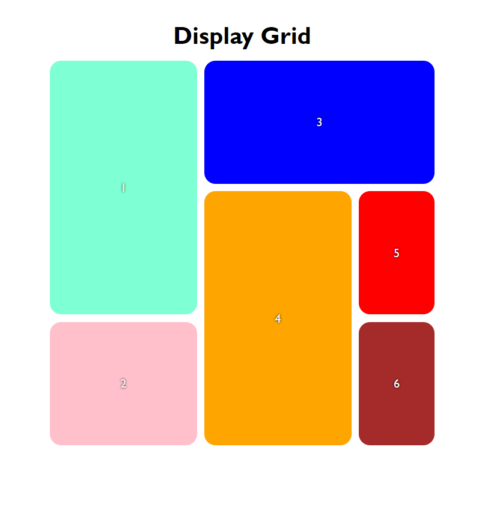

<h1 align="center"> Display Grid on CSS</h1>

<h2 align="center">
Some notes and a complete guide about display grid from CSS-tricks.
</h2>

 

   

 

<h2 align="center"> Concluding my <strong>theoric</strong> part I did a short exercise about it on this project. </h2>

 

    

---
